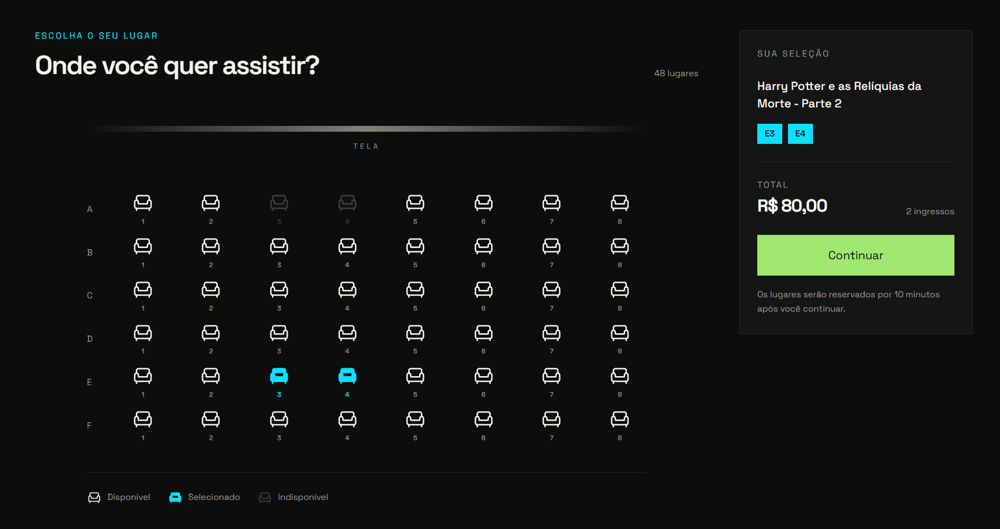
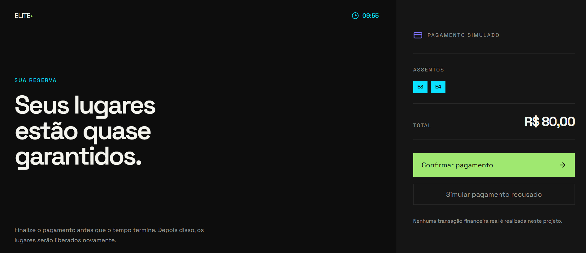
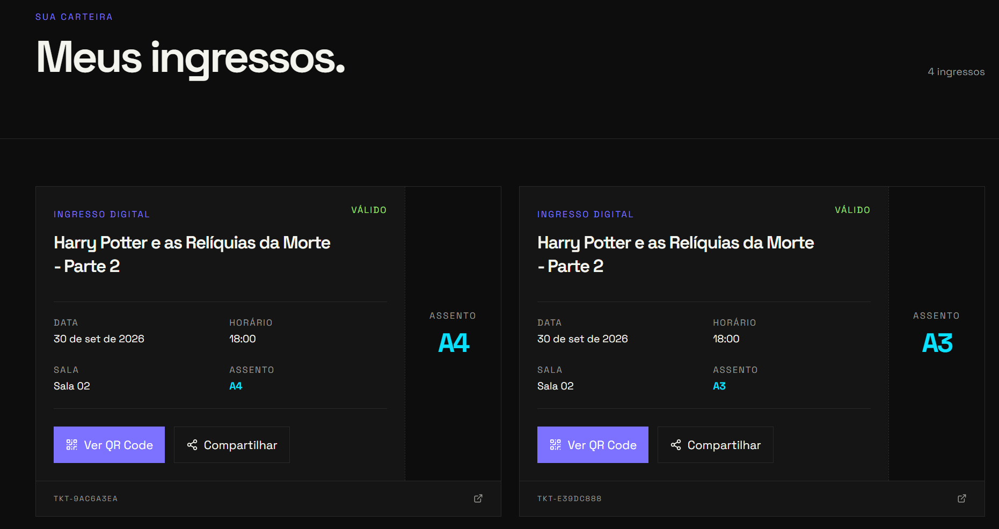
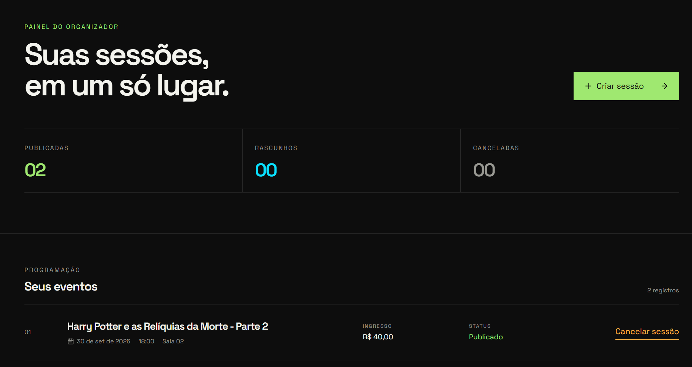
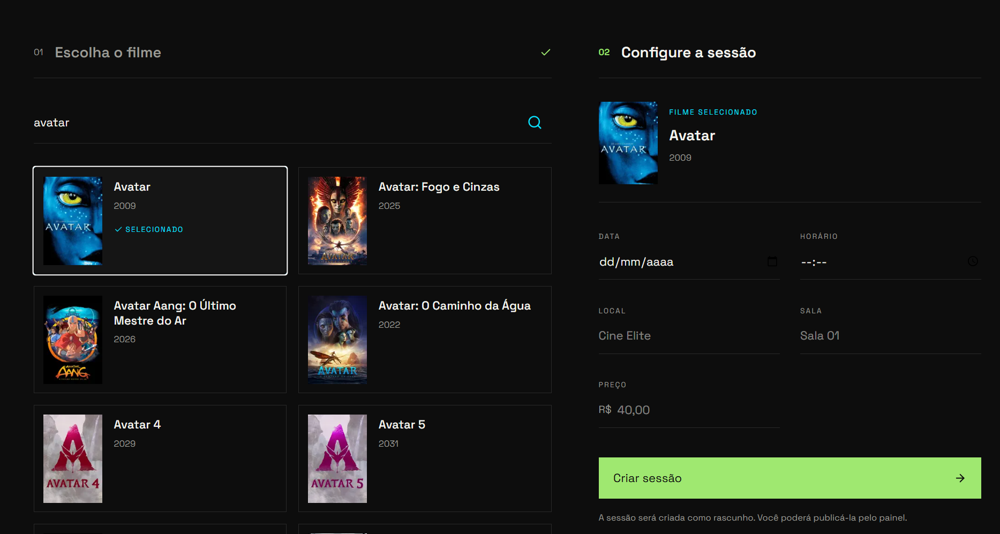
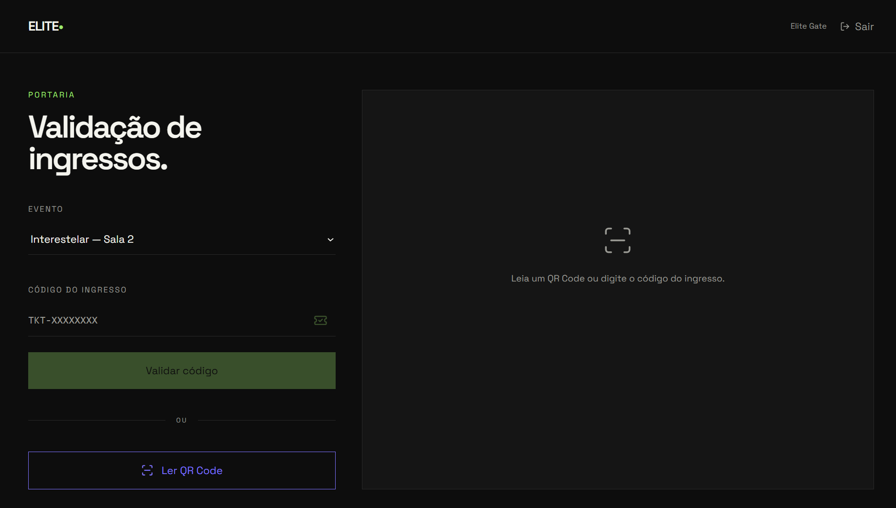

# 🎬 Elite Tickets

Plataforma full stack para criação, reserva, compra e validação de ingressos para sessões de cinema.

O projeto foi desenvolvido como desafio técnico e contempla o fluxo completo de uma plataforma de ingressos, desde a criação da sessão pelo organizador até a validação do ingresso na portaria.


A aplicação possui três perfis distintos:

- `CUSTOMER` — cliente
- `ORGANIZER` — organizador
- `GATE` — portaria

Cada perfil possui permissões e fluxos específicos.

---

## 🌐 Aplicação em produção

### Frontend

https://elite-dev-web.vercel.app/

### Backend / API

https://elite-dev-api-mu.vercel.app/

## 🔑 Acesso de demonstração

Para facilitar a avaliação dos diferentes fluxos da aplicação, o ambiente de demonstração possui usuários específicos para cada perfil.

| Perfil | E-mail | Senha |
|---|---|---|
| Customer | `customer1@elite.dev` | `Elite@123` |
| Organizer | `organizer@elite.dev` | `Elite@123` |
| Gate | `gate@elite.dev` | `Elite@123` |

As credenciais acima pertencem exclusivamente ao ambiente de demonstração e não são utilizadas em outros serviços.

# ✨ Visão geral

O Elite Tickets representa o ciclo completo de uma sessão de cinema:

```text
ORGANIZER
   ↓
Cria uma sessão
   ↓
Publica o evento
   ↓

CUSTOMER
   ↓
Escolhe a sessão
   ↓
Seleciona os assentos
   ↓
Cria uma reserva
   ↓
Finaliza o pagamento
   ↓
Recebe os ingressos
   ↓

GATE
   ↓
Seleciona o evento
   ↓
Valida o ingresso
   ↓
Libera ou bloqueia a entrada
```

Além do fluxo principal, o sistema também implementa regras relacionadas a:

- autenticação;
- autorização por perfil;
- concorrência de assentos;
- reserva temporária;
- expiração da reserva;
- pagamento aprovado ou recusado;
- geração de ingresso por assento;
- QR Code;
- compartilhamento individual de ingresso;
- utilização única do ingresso;
- gerenciamento do ciclo de vida das sessões.

---

# 🧩 Funcionalidades

## 👤 Cliente — `CUSTOMER`

O cliente utiliza a área pública da aplicação para visualizar sessões e comprar ingressos.

### Sessões disponíveis

A página inicial apresenta as sessões publicadas.

Cada sessão contém informações como:

- filme;
- pôster;
- data;
- horário;
- sala;
- local;
- preço.

A aplicação utiliza os dados cadastrados pelo organizador e as informações obtidas através da integração com a TMDb.

---

## 💺 Seleção de assentos

Cada sessão possui um layout fixo de:

```text
6 fileiras × 8 assentos
```

Total:

```text
48 assentos
```

Distribuição:

```text
A1 A2 A3 A4 A5 A6 A7 A8
B1 B2 B3 B4 B5 B6 B7 B8
C1 C2 C3 C4 C5 C6 C7 C8
D1 D2 D3 D4 D5 D6 D7 D8
E1 E2 E3 E4 E5 E6 E7 E8
F1 F2 F3 F4 F5 F6 F7 F8
```

O cliente pode:

- visualizar os lugares;
- identificar assentos disponíveis;
- identificar assentos indisponíveis;
- selecionar múltiplos assentos;
- remover assentos da seleção;
- visualizar os lugares escolhidos;
- acompanhar o valor total da compra.

Os assentos indisponíveis não podem ser selecionados.



---

## ⏱️ Reserva temporária

Após a seleção, os lugares podem ser reservados temporariamente.

A reserva possui validade de:

```text
10 minutos
```

Durante esse período, os assentos permanecem bloqueados para outros clientes.

A expiração é baseada no `expiresAt` gerado pelo backend.

O frontend utiliza esse horário para exibir o contador regressivo no checkout.

```text
09:59
09:58
09:57
...
00:00
```



O backend continua sendo a fonte de verdade para a validade da reserva.

---

## 🔒 Concorrência de assentos

A disponibilidade é validada novamente no backend durante a criação da reserva.

Isso evita depender apenas do estado exibido pelo frontend.

Fluxo simplificado:

```text
Cliente A seleciona A1
Cliente B também visualiza A1
          ↓
Cliente A reserva primeiro
          ↓
A1 passa para HELD
          ↓
Cliente B tenta reservar
          ↓
Backend verifica disponibilidade novamente
          ↓
Reserva é recusada
```

Essa regra reduz o risco de dois clientes reservarem o mesmo lugar simultaneamente.

---

## 💳 Pagamento simulado

O projeto possui um fluxo de pagamento simulado para permitir testar a jornada completa sem depender de um gateway externo.

### Pagamento aprovado

```text
Reserva
   ↓
Pagamento APPROVED
   ↓
Reserva PAID
   ↓
Assentos confirmados
   ↓
Ingressos criados
```

### Pagamento recusado

```text
Reserva
   ↓
Pagamento DECLINED
   ↓
Reserva PAYMENT_FAILED
   ↓
Assentos liberados
```

A interface possui uma opção específica para simular a recusa do pagamento, permitindo que o avaliador teste esse fluxo facilmente.

---

# 🎟️ Ingressos digitais

Após um pagamento aprovado, a aplicação gera:

```text
1 ingresso por assento
```

Exemplo:

```text
Reserva
├── C4 → Ticket 1
├── C5 → Ticket 2
└── C6 → Ticket 3
```

Cada ingresso possui:

- identificador próprio;
- código individual;
- assento;
- sessão;
- status;
- QR Code;
- token de compartilhamento.



---

## 🔳 QR Code

Cada ingresso pode exibir um QR Code individual.

O QR Code utiliza um token gerado e assinado pelo backend.

Isso permite que a portaria valide o ingresso sem depender apenas de um identificador simples enviado pelo frontend.

A assinatura utiliza:

```env
QR_SECRET
```

mantido apenas no backend.

---

## 🔗 Compartilhamento individual

Cada ingresso também possui um link público próprio.

Mesmo que uma reserva tenha vários ingressos, cada link apresenta somente o ingresso correspondente.

Exemplo:

```text
Reserva
├── A1
├── A2
└── A3
```

O link de `A2` não exibe informações de `A1` ou `A3`.

A página compartilhada apresenta somente os dados necessários do ingresso e da sessão.

---

# 🎟️ Meus ingressos

Clientes autenticados podem acessar:

```text
/meus-ingressos
```

A página apresenta os ingressos emitidos para o usuário.

Cada card contém informações como:

- filme;
- data;
- horário;
- sala;
- assento;
- código;
- status;
- acesso ao QR Code;
- opção de compartilhamento.

Os principais status exibidos são:

```text
VALID
USED
CANCELLED
```

---

# 🎬 Organizador — `ORGANIZER`

O organizador possui uma área própria de gerenciamento.

Após o login:

```text
ORGANIZER
→ /organizador
```

---

## 📊 Dashboard

O dashboard apresenta um resumo das sessões:

```text
Publicadas
Rascunhos
Canceladas
```

Também exibe a listagem dos eventos cadastrados pelo organizador.

Para cada sessão são exibidos:

- filme;
- data;
- horário;
- sala;
- preço;
- status;
- ações disponíveis.



---

# 🔎 Busca de filmes com TMDb

A criação de uma sessão começa com a pesquisa do filme.

O frontend não acessa diretamente a TMDb.

Fluxo:

```text
Next.js
   ↓
Express API
   ↓
TMDb
```

Dessa forma, a credencial:

```env
TMDB_ACCESS_TOKEN
```

permanece apenas no backend.

O organizador pode pesquisar um título, visualizar os resultados e selecionar o filme desejado.




---

# ➕ Criação de sessão

Após selecionar o filme, o organizador informa:

- data;
- horário;
- local;
- sala;
- preço.

O frontend envia para o backend:

```text
tmdbMovieId
dateTime
location
room
price
```

O backend utiliza o ID da TMDb para recuperar os dados do filme.

O `organizerId` não é enviado manualmente pelo frontend.

Ele é obtido a partir do usuário autenticado através do JWT.

---

## 🎫 Geração automática dos assentos

Ao criar um evento, a API gera automaticamente os 48 lugares da sessão.

```text
A1 → A8
B1 → B8
C1 → C8
D1 → D8
E1 → E8
F1 → F8
```

Assim, cada evento possui seu próprio mapa de assentos.

---

# 🔄 Ciclo de vida da sessão

Os eventos possuem estados distintos.

### Rascunho

```text
DRAFT
```

Permite:

- publicar;
- excluir.

### Publicado

```text
PUBLISHED
```

Permite:

- visualização na área pública;
- reservas;
- cancelamento pelo organizador.

### Cancelado

```text
CANCELLED
```

É mantido como histórico.

A sessão publicada não é simplesmente excluída, evitando perda de histórico.

Fluxo:

```text
DRAFT
├── DELETE
└── PUBLISHED
       ↓
   CANCELLED
```

---

# 🚪 Portaria — `GATE`

A aplicação possui uma interface operacional específica para a entrada do evento.

Após o login:

```text
GATE
→ /portaria
```

---

## Seleção da sessão

Antes de validar um ingresso, a portaria seleciona a sessão correspondente.

Isso permite verificar não apenas se o ingresso existe, mas também se pertence ao evento correto.

---

## Validação manual

A portaria pode informar diretamente o código do ingresso.

O backend retorna um dos possíveis resultados.

### Válido

```text
VALID
→ Entrada liberada
```

### Já utilizado

```text
ALREADY_USED
→ Ingresso já utilizado
```

### Sessão incorreta

```text
WRONG_EVENT
→ Ingresso de outra sessão
```

### Inválido

```text
INVALID
→ Entrada não autorizada
```

---

# 📷 Scanner de QR Code

Além do código manual, a portaria também permite validar o ingresso através da câmera.

Foi utilizada uma biblioteca de leitura de QR Code integrada ao React.



Fluxo:

```text
Câmera
  ↓
QR Code
  ↓
qrToken
  ↓
POST /gate/validate
  ↓
Resultado
```

A leitura pela câmera funciona em ambiente seguro HTTPS, como no deploy da Vercel.

---

# 🚦 Utilização única

Após uma validação bem-sucedida:

```text
VALID
  ↓
USED
```

Uma nova tentativa de utilizar o mesmo ingresso retorna:

```text
ALREADY_USED
```

Essa validação é controlada pelo backend, e não apenas pela interface da portaria.

---

# 👥 Perfis e permissões

A aplicação utiliza três papéis.

| Role | Responsabilidade |
|---|---|
| `CUSTOMER` | compra e gerenciamento dos próprios ingressos |
| `ORGANIZER` | criação e gerenciamento das sessões |
| `GATE` | validação dos ingressos na entrada |

O backend utiliza middlewares para autenticação e autorização.

Exemplo:

```text
Request
   ↓
authenticate
   ↓
request.user
   ↓
authorizeRole("ORGANIZER")
   ↓
Controller
```

Isso significa que esconder um botão no frontend não é considerado proteção suficiente.

As ações críticas também são verificadas pela API.

---

# 🔐 Autenticação

A aplicação utiliza JWT.

Fluxo:

```text
POST /auth/login
        ↓
credenciais verificadas
        ↓
JWT gerado
        ↓
frontend armazena sessão
        ↓
Authorization: Bearer TOKEN
```

O token possui tempo de expiração configurável através de:

```env
JWT_EXPIRES_IN
```

---

# 🔑 Hash das senhas

As senhas não são armazenadas em texto puro.

Foi utilizado:

```text
bcryptjs
```

para geração e comparação do hash das credenciais.

---

# ✅ Validação de entrada

A API utiliza:

```text
Zod
```

para validar dados recebidos.

Entre os dados validados estão:

- credenciais;
- criação de evento;
- datas;
- preço;
- IDs;
- parâmetros de operações.

Exemplo conceitual:

```text
Request
  ↓
Zod
  ↓
válido?
 ├── não → 400
 └── sim → Service
```

---

# 🏗️ Arquitetura

O projeto está organizado em um monorepo com npm workspaces.

```text
elite-dev/
│
├── apps/
│   │
│   ├── api/
│   │   ├── api/
│   │   │   └── index.ts
│   │   │
│   │   ├── prisma/
│   │   │   ├── migrations/
│   │   │   ├── schema.prisma
│   │   │   └── seed.ts
│   │   │
│   │   └── src/
│   │       ├── database/
│   │       ├── middlewares/
│   │       ├── modules/
│   │       ├── types/
│   │       ├── app.ts
│   │       └── server.ts
│   │
│   └── web/
│       ├── public/
│       ├── src/
│       │   ├── app/
│       │   ├── components/
│       │   ├── lib/
│       │   ├── services/
│       │   └── types/
│       │
│       ├── jest.config.ts
│       ├── jest.setup.ts
│       └── vercel.json
│
├── package.json
├── package-lock.json
└── README.md
```

---

# ⚙️ Organização do backend

O backend foi estruturado por módulos.

Os principais domínios são:

```text
auth
events
reservations
payments
tickets
gate
catalog
```

Cada módulo segue uma separação semelhante:

```text
routes
   ↓
controller
   ↓
service
   ↓
Prisma
```

---

## Routes

Responsáveis por:

- definir endpoints;
- registrar middlewares;
- encaminhar a requisição ao controller.

---

## Controllers

Responsáveis pela camada HTTP:

- interpretar parâmetros;
- validar dados;
- identificar usuário autenticado;
- retornar códigos HTTP;
- formatar respostas.

---

## Services

Concentram as regras de negócio.

Exemplos:

- criação de assentos;
- criação da reserva;
- validação da disponibilidade;
- processamento de pagamento;
- criação dos ingressos;
- publicação e cancelamento;
- validação da portaria.

---

# 🗄️ Banco de dados

A aplicação utiliza:

```text
PostgreSQL
```

hospedado no:

```text
Supabase
```

O acesso é realizado através do Prisma.

---

# 🔷 Prisma ORM

O Prisma é utilizado para:

- modelagem;
- migrations;
- queries;
- relacionamentos;
- transactions;
- integração com PostgreSQL.

No deploy serverless, a conexão utiliza o pooler do Supabase.

---

# 🧱 Principais entidades

## User

Representa os usuários.

Possui, entre outros dados:

```text
id
name
email
passwordHash
role
```

---

## Event

Representa uma sessão específica de um filme.

```text
movie
dateTime
location
room
price
organizer
status
```

---

## EventSeat

Representa um assento pertencente a uma sessão.

```text
eventId
row
number
status
```

---

## Reservation

Representa a reserva criada pelo cliente.

Controla:

```text
customer
event
status
expiresAt
```

---

## Ticket

Representa o ingresso emitido após o pagamento.

Um ingresso pertence a um único assento.

---

# 🌱 Seed

O projeto possui um seed para facilitar testes e avaliação local.

A configuração utilizada durante o desenvolvimento inclui:

```text
1 ORGANIZER
2 CUSTOMER
1 GATE
1 Event PUBLISHED
48 EventSeats AVAILABLE
```

As senhas são armazenadas usando bcrypt.

---

# 🛠️ Stack

## Frontend

- Next.js 16
- React
- TypeScript
- Tailwind CSS
- Lucide React
- `@yudiel/react-qr-scanner`
- Jest
- React Testing Library
- Testing Library User Event

---

## Backend

- Node.js
- Express 5
- TypeScript
- Prisma 7
- `@prisma/adapter-pg`
- PostgreSQL
- Zod
- JWT
- bcryptjs
- QRCode

---

## Infraestrutura

- Vercel — frontend
- Vercel — backend
- Supabase — PostgreSQL
- TMDb — catálogo de filmes

---

# 🧪 Testes automatizados

O frontend possui testes com:

```text
Jest
+
React Testing Library
```

Atualmente:

```text
Test Suites: 4 passed
Tests:       10 passed
```

As áreas cobertas incluem:

---

## Login

Testa:

- comportamento de erro;
- autenticação;
- redirect por perfil.

---

## Seleção de assentos

Testa:

- seleção de lugar disponível;
- atualização do total;
- bloqueio de assento indisponível.

---

## Organizador

Testa ações conforme o status da sessão:

```text
DRAFT
→ Excluir
→ Publicar

PUBLISHED
→ Cancelar sessão

CANCELLED
→ Histórico
```

---

## Portaria

Testa respostas como:

```text
VALID
ALREADY_USED
INVALID
```

---

## Executando os testes

Na raiz:

```bash
npm test --workspace=web
```

---

# 🚀 Deploy

## Frontend

Hospedado na Vercel:

```text
https://elite-dev-web.vercel.app/
```

## Backend

Hospedado na Vercel:

```text
https://elite-dev-api-mu.vercel.app/
```

## Banco

Hospedado no Supabase.

---

# 🔧 Variáveis de ambiente

## API

Crie:

```text
apps/api/.env
```

Exemplo:

```env
DATABASE_URL=
JWT_SECRET=
JWT_EXPIRES_IN=1d
TMDB_ACCESS_TOKEN=
QR_SECRET=
```

---

## Frontend

Crie:

```text
apps/web/.env.local
```

```env
NEXT_PUBLIC_API_URL=http://localhost:3333
```

Em produção:

```env
NEXT_PUBLIC_API_URL=https://elite-dev-api-mu.vercel.app
```

---

# 💻 Executando localmente

## Pré-requisitos

- Node.js;
- npm;
- PostgreSQL ou projeto Supabase;
- token da TMDb.

---

## 1. Clone

```bash
git clone https://github.com/elanealencar/elite-dev.git
cd elite-dev
```

---

## 2. Instale

```bash
npm install
```

Como o projeto utiliza workspaces, as dependências do frontend e backend são gerenciadas a partir da raiz.

---

## 3. Configure as variáveis

Crie:

```text
apps/api/.env
```

e:

```text
apps/web/.env.local
```

---

## 4. Gere o Prisma Client

```bash
npm exec prisma generate --workspace=api
```

---

## 5. Migrations

```bash
npm exec prisma migrate dev --workspace=api
```

---

## 6. Seed

```bash
npm run seed --workspace=api
```

---

## 7. Backend

```bash
npm run dev --workspace=api
```

API local:

```text
http://localhost:3333
```

---

## 8. Frontend

Em outro terminal:

```bash
npm run dev --workspace=web
```

Aplicação:

```text
http://localhost:3000
```

---

# 📦 Build

## API

```bash
npm run build --workspace=api
```

## Web

```bash
npm run build --workspace=web
```

---

# 📡 Alguns endpoints

## Auth

```text
POST /auth/login
```

---

## Eventos

```text
GET    /events
GET    /events/:id
GET    /events/:id/seats

POST   /events
PATCH  /events/:id/publish
PATCH  /events/:id/cancel
DELETE /events/:id
```

---

## Reservas

```text
POST /reservations
```

---

## Pagamento

```text
PATCH /reservations/:id/pay
```

---

## Tickets

```text
GET /tickets/me
GET /tickets/:id/qr
GET /tickets/share/:shareToken
```

---

## Portaria

```text
POST /gate/validate
```

---

## Catálogo

```text
GET /catalog/movies?query=
```

---

# 🎨 Interface

A aplicação utiliza uma identidade visual predominantemente dark, com uma estética editorial e minimalista.

Foram utilizadas três cores principais de destaque:

```text
#9FE870
#0AE1FF
#7D72FF
```

Essas cores foram associadas a diferentes momentos da experiência.

### Verde

Utilizado em:

- ações principais;
- sucesso;
- pagamento aprovado;
- publicação.

### Ciano

Utilizado em:

- seleção;
- assentos;
- feedback intermediário.

### Violeta

Utilizado em:

- identidade dos ingressos;
- QR Code;
- elementos de destaque.

A intenção foi evitar uma interface genérica de dashboard e criar uma linguagem visual única entre as três experiências.

---

# 📱 Responsividade

A aplicação foi revisada em diferentes larguras, incluindo:

```text
375px
768px
1440px
```

Os principais grids e painéis reorganizam-se de acordo com o espaço disponível.

---

# 💡 Principais decisões técnicas

## Monorepo

Frontend e backend foram mantidos no mesmo repositório utilizando npm workspaces.

Isso facilita:

- instalação;
- versionamento;
- scripts;
- integração;
- manutenção.

---

## Supabase + PostgreSQL

PostgreSQL foi escolhido para representar adequadamente relacionamentos entre:

```text
usuários
eventos
assentos
reservas
pagamentos
tickets
```

O Supabase foi utilizado como infraestrutura do banco.

---

## Prisma

O Prisma foi utilizado para simplificar:

- acesso ao banco;
- tipagem;
- migrations;
- relacionamentos;
- transactions.

---

## TMDb no backend

O frontend não recebe a credencial da TMDb.

Toda consulta ao catálogo passa pela API própria.

Isso mantém:

```env
TMDB_ACCESS_TOKEN
```

fora do navegador.

---

## Backend como fonte de verdade

Regras críticas não dependem apenas da interface.

Exemplos:

```text
disponibilidade do assento
expiração da reserva
autorização
pagamento
estado do ticket
validação da portaria
```

são verificadas no backend.

---

# 🔮 Possíveis evoluções

Algumas funcionalidades poderiam ser adicionadas em uma evolução do projeto:

- gateway de pagamento real;
- envio de ingressos por e-mail;
- edição de sessão em rascunho;
- recuperação de senha;
- paginação;
- filtros;
- dashboard de vendas;
- diferentes layouts de sala;
- notificações;
- testes de integração no backend;
- testes E2E com Playwright ou Cypress;
- observabilidade;
- monitoramento;
- filas;
- processamento agendado de reservas expiradas.

---

# 👩‍💻 Autora

**Elane Alencar**
Desenvolvedora Full Stack.
https://linkedin.com/in/elanealencar/
dev.elanealencar@gmail.com